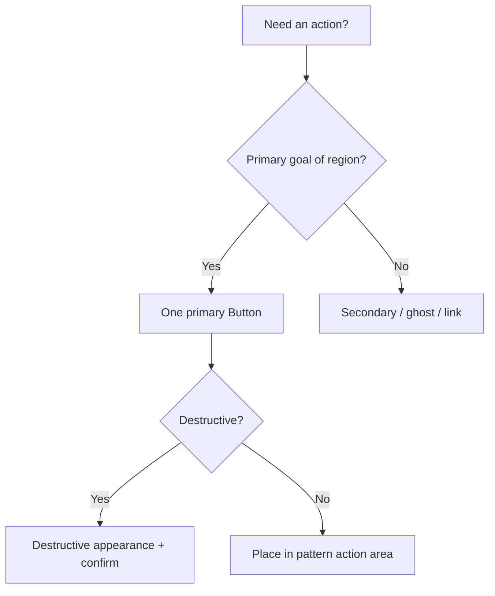

# Decision tree: Buttons

## What

Branching reasoning for **buttons** decisions. Icon glyph scale: [`button-icon-size`](../../semantics/button-icon-size.md).

## Why

Isolated tips do not scale. Trees force intent → structure → component order.

## When

Before generating or refactoring UI in this category.

## Tree

## Reasoning outline

Action needed?
→ Region’s primary goal → one primary Button
→ Supporting → secondary/ghost
→ Destructive → destructive + confirm dialog
Belong inside pattern actions

Confidence: Preferred — Follow the tree; jump to recipes only after intent is classified.

## Relationships

### Supports

- Deterministic AI composition

### Requires

- Intent

### Influences

- Patterns
- Ontology

### Uses

- Grammar
- Semantics

### Conflicts With

- Ad-hoc component soup

### Alternatives

- choosing-patterns for recipe routing

### Depends On

- intent

### Referenced By

- ai/indexes/decision-index.md

## See also

- [Choosing patterns](../choosing-patterns.md)
- [Grammar rules](../../grammar/rules.md)
