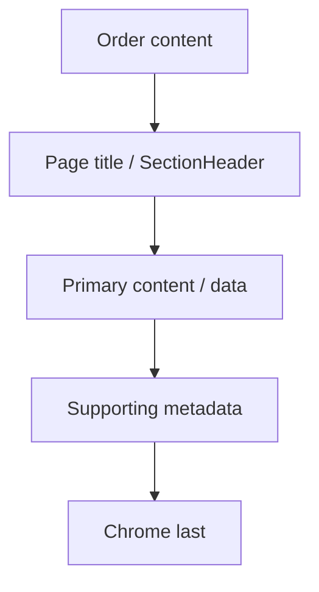

# Decision tree: Content hierarchy

## What

Branching reasoning for **content hierarchy** decisions.

## Why

Isolated tips do not scale. Trees force intent → structure → component order.

## When

Before generating or refactoring UI in this category.

## Tree

## Reasoning outline

Order content:
1 Page title (`PageHeaderTitle` — largest type, default heading/28)
2 Primary content under `SectionHeader` (body/20/semibold h2 recommended)
3 Supporting metadata
4 Chrome / secondary actions
Map to Text roles + SectionHeader; never match/exceed page title size with lower headlines

Confidence: Preferred — Follow the tree; jump to recipes only after intent is classified.
Confidence: Preferred — Page title largest; other headlines ≥1 size step smaller.

## Relationships

### Supports

- Deterministic AI composition

### Requires

- Intent

### Influences

- Patterns
- Ontology

### Uses

- Grammar
- Semantics

### Conflicts With

- Ad-hoc component soup

### Alternatives

- choosing-patterns for recipe routing

### Depends On

- intent

### Referenced By

- ai/indexes/decision-index.md

## See also

- [Choosing patterns](../choosing-patterns.md)
- [Grammar rules](../../grammar/rules.md)
