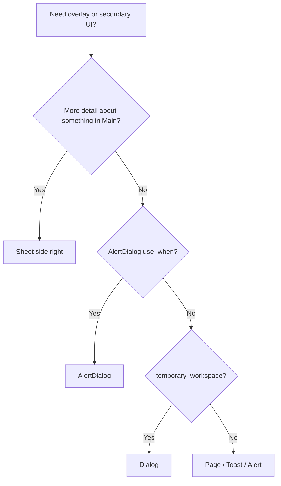

# Decision tree: Dialogs & Alert dialogs

## What

Branching reasoning for **overlays** / inspectors, gated by design intent.

## Why

Modal `Dialog` is **`temporary_workspace`**. `AlertDialog` is **`interrupt_workflow` + `prevent_harm` + `obtain_confirmation`**. Mixing them produces the wrong interruption level.

## When

Before generating or refactoring UI in this category.

## Tree

**AlertDialog `use_when`:** `destructive_action` · `irreversible_action` · `critical_system_error` · `security_warning` · `legal_acknowledgement`  
**AlertDialog `avoid_when`:** `collecting_form_data` · `editing_content` · `lengthy_explanations` · `multi-step_tasks`  
See [`alert-dialogs`](../../patterns/alert-dialogs.md).

**Dialog `temporary_workspace`:** small task + multiple inputs + return to previous context — [`dialogs`](../../patterns/dialogs.md).

## Reasoning outline

Need secondary UI?
→ **More detail about Main content?** → right **`Sheet`**
→ **AlertDialog `use_when`?** → `AlertDialog` (intents: interrupt_workflow, prevent_harm, obtain_confirmation)
→ **AlertDialog `avoid_when`?** → do **not** use AlertDialog
→ **temporary_workspace?** → `Dialog`
→ Large form → `settings-form`; soft ack/error → Toast / Alert
→ Collection drives Main → **listview**, not Sheet

Confidence: Required — Main-content inspectors use right Sheet.

Confidence: Preferred — Follow the tree; do not use Dialog for confirms or AlertDialog for forms.

## Relationships

### Supports

- Deterministic AI composition

### Requires

- Intent

### Influences

- Patterns
- Ontology

### Uses

- Grammar
- Semantics

### Conflicts With

- Ad-hoc component soup
- Dialog for confirmation / AlertDialog for forms

### Alternatives

- choosing-patterns for recipe routing

### Depends On

- intent, dialogs, alert-dialogs

### Referenced By

- ai/indexes/decision-index.md

## See also

- [Alert dialogs pattern](../../patterns/alert-dialogs.md)
- [Dialogs pattern](../../patterns/dialogs.md)
- [Design Intent](../../semantics/intent.md)
- [Right side panel](../../semantics/right-side-panel.md)
- [Choosing patterns](../choosing-patterns.md)
