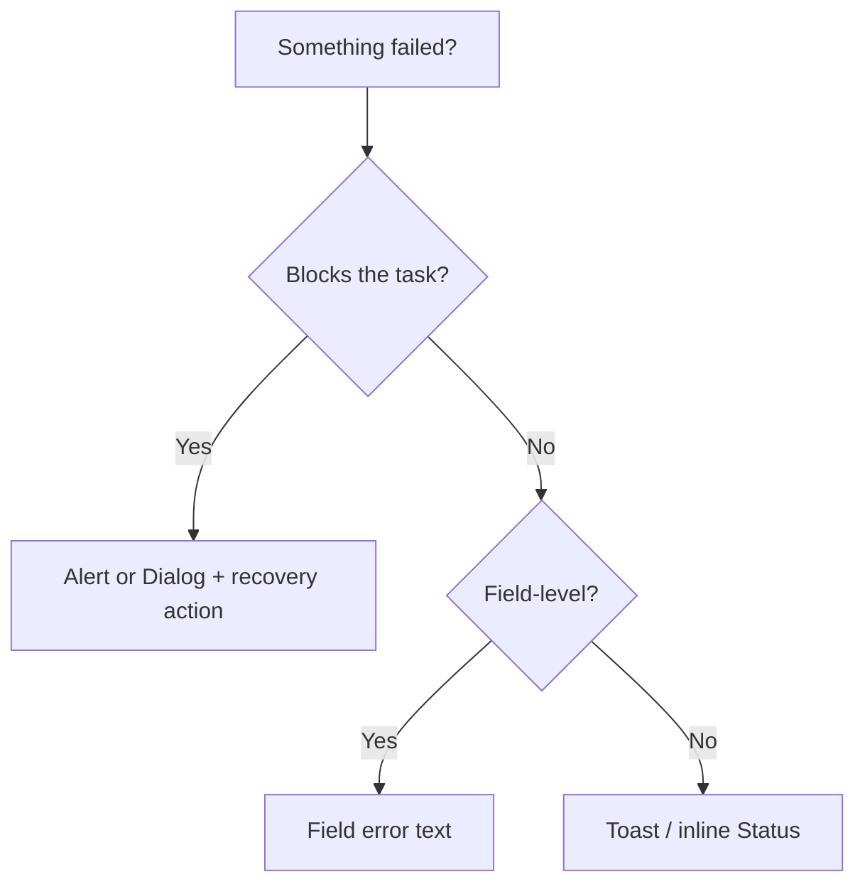

# Decision tree: Errors

## What

Branching reasoning for **errors** decisions.

## Why

Isolated tips do not scale. Trees force intent → structure → component order.

## When

Before generating or refactoring UI in this category.

## Tree

## Reasoning outline

Failure?
→ Blocks task → Alert or Dialog with recovery
→ Field-level → Field error
→ Transient → Toast / Status
Never color-alone

**Color pattern:** errors always use the **destructive** family (`Alert variant="destructive"`, `Status variant="error"`, destructive Field invalid, `Button variant="destructive"` when the action destroys). Do not use warning/success/info chrome for failures — see [`color`](../../foundations/color.md) feedback table.

Confidence: Preferred — Follow the tree; jump to recipes only after intent is classified.

Confidence: **Required** — Error meaning → destructive color pattern.

## Relationships

### Supports

- Deterministic AI composition

### Requires

- Intent

### Influences

- Patterns
- Ontology

### Uses

- Grammar
- Semantics

### Conflicts With

- Ad-hoc component soup

### Alternatives

- choosing-patterns for recipe routing

### Depends On

- intent

### Referenced By

- ai/indexes/decision-index.md

## See also

- [Choosing patterns](../choosing-patterns.md)
- [Grammar rules](../../grammar/rules.md)
