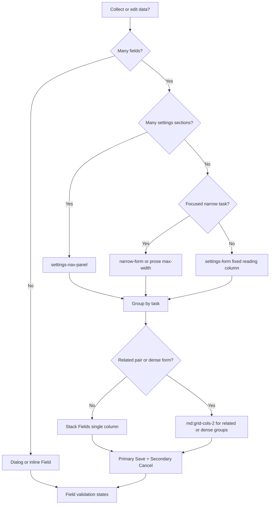

# Decision tree: Forms

## What

Branching reasoning for **forms** decisions.

## Why

Isolated tips do not scale. Trees force intent → structure → component order.

## When

Before generating or refactoring UI in this category.

## Tree

## Reasoning outline

Collect/edit data?
→ Few fields + focused decision → Dialog
→ Many settings sections → `settings-nav-panel`
→ Focused single task → `narrow-form` / prose max-width
→ Otherwise → `settings-form` with `MainContent fixed`
→ Group sections → **stack Fields by default**
→ Multi-column only for related pairs (first/last name) or dense forms that need the space
→ Primary save + secondary cancel
→ Always use Field chrome

Confidence: Preferred — Follow the tree; jump to recipes only after intent is classified.

## Relationships

### Supports

- Deterministic AI composition

### Requires

- Intent

### Influences

- Patterns
- Ontology

### Uses

- Grammar
- Semantics

### Conflicts With

- Ad-hoc component soup

### Alternatives

- choosing-patterns for recipe routing

### Depends On

- intent

### Referenced By

- ai/indexes/decision-index.md

## See also

- [Choosing patterns](../choosing-patterns.md)
- [Grammar rules](../../grammar/rules.md)
