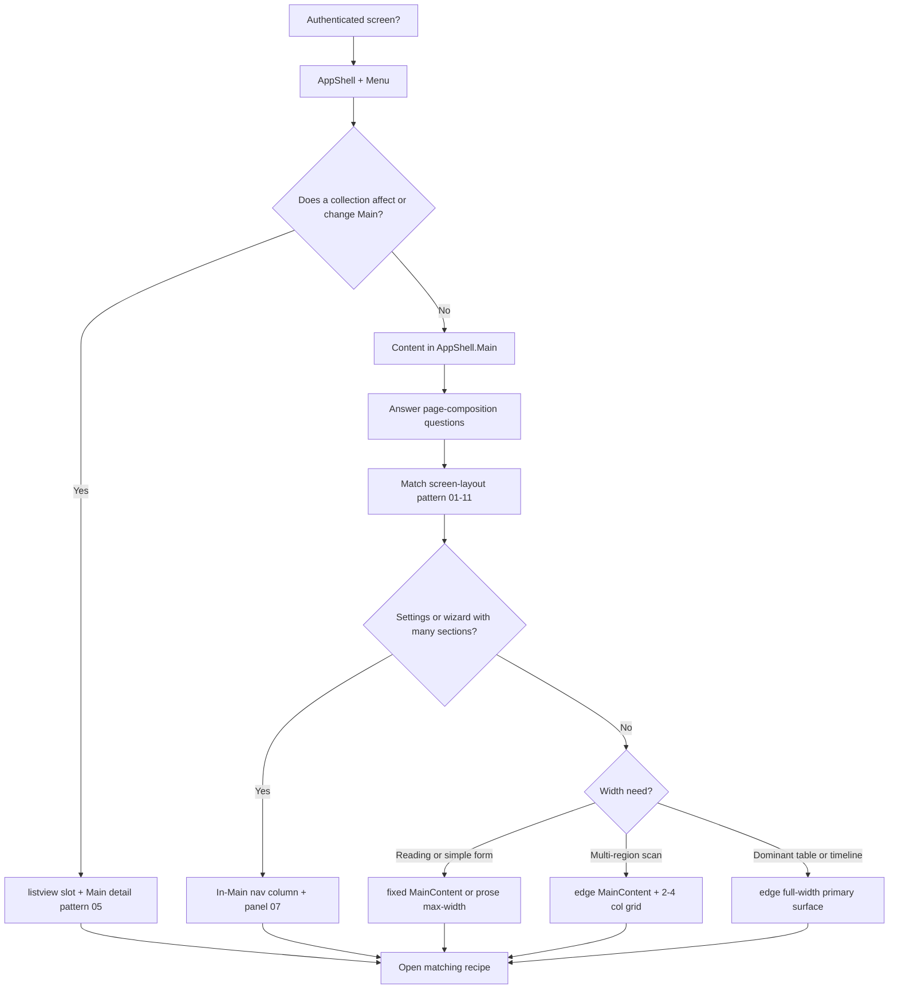

# Decision tree: Layout

## What

Branching reasoning for **layout** decisions.

## Why

Isolated tips do not scale. Trees force intent → structure → component order.

## When

Before generating or refactoring UI in this category.

## Tree

## Reasoning outline

Authenticated?
→ AppShell + Menu
→ Does list/collection content **affect Main**? → **listview** + Main detail — pattern **05** ([`listview-drives-main`](../../semantics/listview-drives-main.md))
→ Else → answer [`page-composition`](../../semantics/page-composition.md) pre-layout questions
→ Match [`screen-layout-patterns`](../../patterns/screen-layout-patterns.md) **01–11**
→ Settings / wizard with many sections? → in-Main nav + panel ([`settings-nav-panel`](../../../ai/recipes/settings-nav-panel.md); pattern **07**)
→ Else by width: reading/form → fixed or prose; multi-region → edge + grid; dominant table/timeline → edge full-width (**03** / **10** / **11**)
→ Open matching recipe from [`choosing-patterns`](../choosing-patterns.md)
Static app → enableRouterOutlet false

Confidence: Required — If the collection drives Main, use listview.

Confidence: Required — Answer page-composition questions before stacking sections.

Confidence: Preferred — Match screen-layout pattern 01–11 before inventing layout.

Confidence: Preferred — Follow the tree; jump to recipes only after intent is classified.

## Relationships

### Supports

- Deterministic AI composition

### Requires

- Intent
- page-composition

### Influences

- Patterns
- Ontology

### Uses

- Grammar
- Semantics

### Conflicts With

- Ad-hoc component soup

### Alternatives

- choosing-patterns for recipe routing

### Depends On

- intent
- page-composition

### Referenced By

- ai/indexes/decision-index.md

## See also

- [Page composition](../../semantics/page-composition.md)
- [Listview when it drives Main](../../semantics/listview-drives-main.md)
- [Choosing layout](../choosing-layout.md)
- [Choosing patterns](../choosing-patterns.md)
- [AppShell.Main containment](../../semantics/appshell-main-containment.md)
- [Grammar rules](../../grammar/rules.md)
