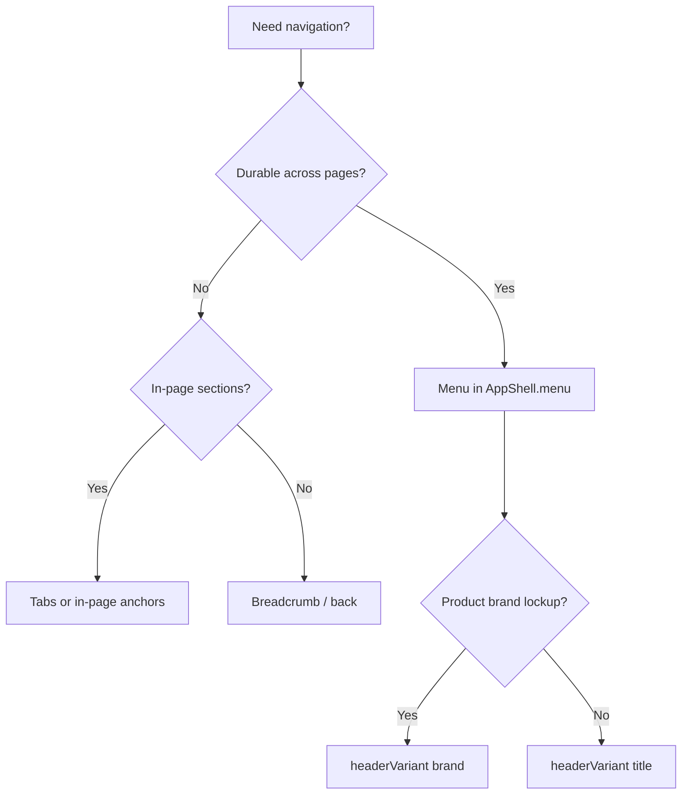

# Decision tree: Navigation

## What

Branching reasoning for **navigation** decisions.

## Why

Isolated tips do not scale. Trees force intent → structure → component order.

## When

Before generating or refactoring UI in this category.

## Tree

## Reasoning outline

Need navigation?
→ Durable across pages? → **Menu** in AppShell.menu
→ Page-local only? → Tabs / section nav
→ Trail context? → Breadcrumb
→ Brand lockup? → headerVariant brand vs title

Confidence: Preferred — Follow the tree; jump to recipes only after intent is classified.

## Relationships

### Supports

- Deterministic AI composition

### Requires

- Intent

### Influences

- Patterns
- Ontology

### Uses

- Grammar
- Semantics

### Conflicts With

- Ad-hoc component soup

### Alternatives

- choosing-patterns for recipe routing

### Depends On

- intent

### Referenced By

- ai/indexes/decision-index.md

## See also

- [Choosing patterns](../choosing-patterns.md)
- [Grammar rules](../../grammar/rules.md)
