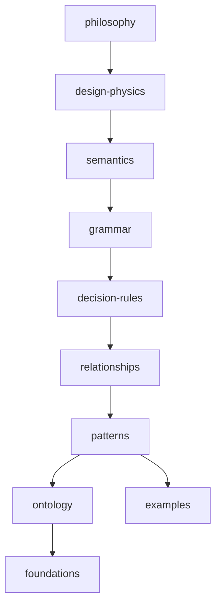

# Relationship graph

Human-readable adjacency for the DSL. Per-document edges live in each file’s **Relationships** section and YAML `depends_on` / `influences` / `conflicts_with` / `alternatives`.

## Layer edges

## High-value edges

| From | Relation | To |
|------|----------|-----|
| intent | influences | choosing-patterns |
| choosing-patterns | uses | ai/recipes |
| grammar-regions | requires | appshell-ontology, menu-ontology |
| hierarchy | influences | content-hierarchy-tree |
| density | influences | dashboards-tree |
| proximity-physics | implements via | proximity, grouping |
| button-ontology | appears in | forms, dialogs, cards |
| layout-mistakes | conflicts with | grammar-rules |

Machine indexes: [`ai/indexes/relationship-index.md`](../../ai/indexes/relationship-index.md).

Confidence: Preferred — Prefer typed edges over orphan pages.

## Relationships

### Supports

- RAG traversal

### Requires

- Front matter on all docs

### Influences

- AI indexes

### Uses

- —

### Conflicts With

- —

### Alternatives

- Future graph.json

### Depends On

- —

### Referenced By

- ai/indexes/relationship-index.md
