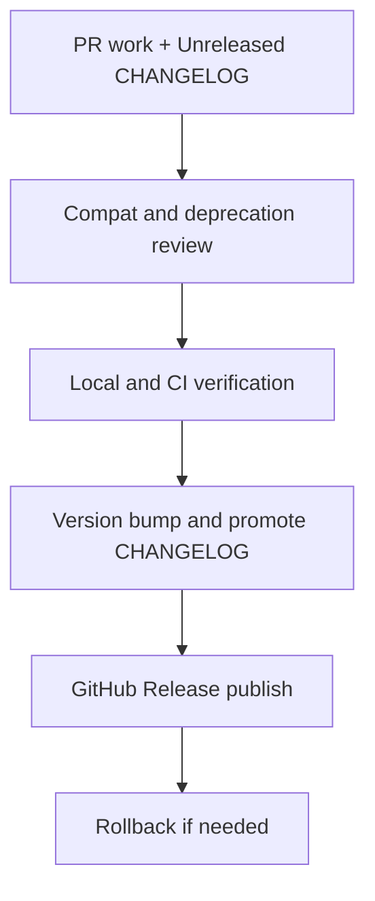

# UDS release checklist

**Required** for every publish of `@chghealthcare/unified-design-system`. Follow this runbook end-to-end so we do not ship silent breaks, skip the changelog, or regress tests/performance.

Companions:

- SemVer rules: [`semver.md`](./semver.md)
- Durable history: [`CHANGELOG.md`](../CHANGELOG.md) (always update)
- Draft Release bullets: [`NEXT_RELEASE_NOTES.md`](./NEXT_RELEASE_NOTES.md)
- Publish triggers / Packages: [`github-packages.md`](./github-packages.md)
- Maintainer overview: [`CONTRIBUTING.md`](../CONTRIBUTING.md)
- PR template: [`.github/PULL_REQUEST_TEMPLATE.md`](../.github/PULL_REQUEST_TEMPLATE.md)
- Release body template: [`.github/RELEASE_TEMPLATE.md`](../.github/RELEASE_TEMPLATE.md)



---

## Phase A — Feature / fix PR (before merge)

- [ ] Classify the change: **patch** / **minor** / **major** per [`semver.md`](./semver.md).
- [ ] **Backwards compatibility first:** prefer additive APIs, root re-exports, or `@deprecated` shims over removals (examples: Card heading shims, Drawer / DateInput root restore).
- [ ] Update **[`CHANGELOG.md`](../CHANGELOG.md) `[Unreleased]`** in the same PR (**Required**).
- [ ] Optionally mirror draft bullets in [`NEXT_RELEASE_NOTES.md`](./NEXT_RELEASE_NOTES.md) for the GitHub Release body.
- [ ] If public API, imports, or behavior change: add or update a migration note (`docs/MIGRATION-*.md` and/or PR section) with **before/after** code.
- [ ] Fill the [PR template](../.github/PULL_REQUEST_TEMPLATE.md) completely (compat fields may be “none”).

---

## Phase B — Compat / breaking review

**Required** for minor and major. Also required for **patch** when exports, props, CSS tokens, or import paths change.

Document in the PR and later in the Release body:

| Field | Required content |
|-------|------------------|
| **Breaking changes** | Explicit list or `none` |
| **Required team actions** | What consumer apps must do (imports, props, CSS, Vitest subpaths) |
| **Before-and-after** | Minimal code snippets |
| **Deprecation timeline** | What is deprecated and the removal target (e.g. next major) |
| **Compatibility risks** | Who breaks (root barrel vs subpath, styles.css-only apps, Vitest) |
| **Rollback approach** | How to pin the previous version; when to yank / ship a patch |

### Hard rules

- Removing public exports or props → **major**, or ship a `@deprecated` shim first.
- Moving modules off the root barrel without a re-export → **breaking**.
- Renaming CSS tokens without aliases → **breaking**.
- Do not rely on trial installs for consumers to discover breaks — CHANGELOG + migration notes are the contract.

---

## Phase C — Verification (green before version bump)

Confirm CI on `main` (or the release PR) is green. Run locally when practical:

```bash
npm ci
npm run build:lib          # subpath --check / --verify-dist, theme.css, lazy barrel
npm test                   # or: npm run test:unit
npm run ci:bundle          # per-component gzip budgets
npm run pack:check
# When docs routes change (or rely on CI docs-smoke):
npm run test:docs-smoke
```

### Consumer-sensitive spot checks

- [ ] Touched modules resolve from **root** and **subpath** where both are public.
- [ ] Vitest guidance still holds: tests use kebab subpaths, not the root barrel ([`setup.md`](../setup.md), TD-UDS-010).
- [ ] If `theme.css` / Tailwind docs changed: no guidance that stacks a second full preflight on top of `styles.css`.

### Performance bar

- [ ] Did this grow **root-barrel** eager cost? Prefer subpaths; avoid new heavy deps on the root graph.
- [ ] `ci:bundle` still green.
- [ ] Published CSS / pack contents still look sane (`pack:check`).

---

## Phase D — Cut the release

1. [ ] Bump `version` in [`package.json`](../package.json) on `main` (match SemVer intent from Phase A).
2. [ ] **Promote** `[Unreleased]` → `## [x.y.z] - YYYY-MM-DD` in [`CHANGELOG.md`](../CHANGELOG.md) (**Required** — never publish with only `NEXT_RELEASE_NOTES`).
3. [ ] Clear or replace [`NEXT_RELEASE_NOTES.md`](./NEXT_RELEASE_NOTES.md) for the next cycle.
4. [ ] **Minor / major only:** docs snapshot — `npm run build:docs`, commit under `src/docs/versions/` (see [`docs-version-snapshots.md`](./docs-version-snapshots.md)).
5. [ ] Merge to `main` if the bump is on a branch; ensure Phase C CI is green on the release commit.
6. [ ] Create a **published** GitHub Release for tag `vx.y.z` (or `x.y.z` matching repo convention). Paste from [`.github/RELEASE_TEMPLATE.md`](../.github/RELEASE_TEMPLATE.md): CHANGELOG section + migration links + the six compat fields.
7. [ ] Confirm [Publish GitHub Package](../.github/workflows/publish-github-packages.yml) ran successfully (Release trigger or dry-run then real `workflow_dispatch`).
8. [ ] Announce to consumers: version, breaking/none, required actions, migration link, rollback pin.

Optional tarball check:

```bash
npm run build:lib
npm pack
```

---

## Phase E — Rollback

If a release is bad:

| Actor | Action |
|-------|--------|
| **Consumers** | Pin the previous good version exactly (e.g. `"1.3.0"`) until a fix ships. |
| **Maintainers** | Do **not** force-republish the same version. Ship `x.y.z+1` with a fix or restored shims. |
| **Critical** | Mark the GitHub Release “yanked / do not use” in the notes; publish a patch that reverts or fixes. |

Rollback note for the next CHANGELOG entry: call out the bad version and the fix version.

---

## CHANGELOG discipline (every cycle)

| When | What |
|------|------|
| Every PR that affects consumers | Add bullets under `[Unreleased]` |
| Release cut | Move `[Unreleased]` into `## [version] - date`; leave a fresh empty `[Unreleased]` |
| Publish | GitHub Release body must match or summarize that CHANGELOG section |

Keep a Changelog sections (`Added` / `Changed` / `Deprecated` / `Removed` / `Fixed` / `Security`) as appropriate.

---

## Quick links

- Migration example: [`MIGRATION-1.0-to-1.2.md`](./MIGRATION-1.0-to-1.2.md)
- Subpath / Vitest: [`td-uds-010-test-performance-spec.md`](./td-uds-010-test-performance-spec.md) (if present) and [`setup.md`](../setup.md)
- Consumer Tailwind preset: [`consumers-tailwind-v4-preset.md`](./consumers-tailwind-v4-preset.md)
