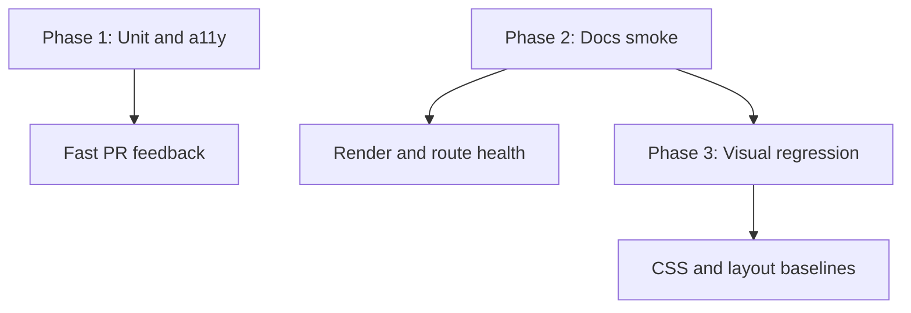

# Component regression testing plan

Automated regression coverage for UDS React components across three layers. **Phase 1 is implemented**; Phases 2–3 are wired as a separate CI job.

## Status

| Phase | Status | How to run |
|-------|--------|------------|
| **1 — Unit / a11y** | Implemented | `npm run test:unit` (Vitest + Testing Library; colocated `src/components/ui/*.test.tsx`) |
| **2 — Docs smoke** | Implemented | `npm run test:docs-smoke` (Playwright × `SHADCN_UI_SLUGS`) |
| **3 — Visual** | Narrow baselines (darwin committed; enable CI when `*-linux.png` present) | `npm run test:visual` / `test:visual:update` — see [`e2e/visual/README.md`](../e2e/visual/README.md) |

Harness: [`src/test/setup.ts`](../src/test/setup.ts), [`src/test/helpers/render-with-uds.tsx`](../src/test/helpers/render-with-uds.tsx), [`vitest.config.ts`](../vitest.config.ts). Script tests remain under `npm run test:scripts`; `npm test` runs scripts then unit.

## Goals

- Catch **behavior** regressions (props, events, accessibility, composition).
- Catch **visual** regressions (Tailwind utilities, `--uds-*` tokens, `data-brand` themes, layout).
- Reuse the **docs site** as the canonical component gallery instead of duplicating every example in Storybook.
- Keep CI fast enough for every PR while allowing deeper visual checks on main or labeled PRs.

## Current state (baseline)

| Area | What exists | Notes |
|------|-------------|--------|
| **CI** (`.github/workflows/ci.yml`) | `lint`, `build:lib`, `test:scripts`, `test:unit`, validators, `pack:check` | `docs-smoke` job: Playwright smoke + narrow visuals |
| **Typecheck** | `npm run typecheck` | Types only; no DOM or CSS |
| **Bundle budget** | `npm run ci:bundle` | Tree-shake size for `Button` import only |
| **Consumer fixture** | `npm run test:consumer-fixture` | `.consumer-perf` app builds against `file:..` package |
| **Docs versions** | `npm run test:docs-versions` | Latest frozen snapshot **manifest** loads; pages are not rendered |
| **Docs examples** | `src/docs/shadcn-examples/registry.tsx` + `SHADCN_UI_SLUGS` | Also driven by docs smoke / visual e2e |
| **Unit/component tests** | First-wave colocated `*.test.tsx` | Expand per component as needed |

### Canonical sources of truth today

- **Component implementations:** `src/components/ui/*.tsx`
- **Published surface:** `dist/` via `npm run build:lib`
- **Doc examples & variant matrices:** `src/docs/shadcn-examples/registry.tsx` keyed by `src/docs/shadcn-ui-registry.ts` (`SHADCN_UI_SLUGS`)
- **Styles & brands:** `src/styles/` (`uds-tokens.css`, brand blocks, `data-brand` selectors)
- **AI / integration contracts:** `ai/uds-contract.json`, `ai/appshell.schema.json` (separate from UI pixels)

---

## Test layers (overview)

Three complementary layers; none replaces the others in a token-heavy design system.



| Layer | Typical tools | Speed | Best for |
|-------|---------------|-------|----------|
| Behavior / contract | Vitest, React Testing Library, `jsdom` | Fast | Props, events, roles, keyboard |
| Docs smoke | Playwright (or similar) | Medium | “Page loads, no crash, no console error” |
| Visual regression | Playwright screenshots, optional Chromatic/Percy | Slower | Token/CSS/layout drift |

---

## Phase 1: Unit and accessibility tests

### Objective

Prove components **render**, **behave**, and meet **basic a11y contracts** under controlled wrappers—without depending on the full docs app or Figma.

### Recommended tooling

- **Vitest** — test runner (ESM-friendly, fits Vite repo).
- **@testing-library/react** + **@testing-library/user-event** — render and interaction.
- **@testing-library/jest-dom** — matchers (`toBeVisible`, `toHaveAttribute`, …).
- **jsdom** — default environment; consider **Vitest browser mode** later for components that depend on layout APIs jsdom lacks.
- Optional: **vitest-axe** or **jest-axe** for automated a11y rules on representative trees.

### What to test

| Category | Examples |
|----------|----------|
| **Render smoke** | Component mounts with default props and required children |
| **Variants** | `appearance`, `size`, `disabled`, `error` state where applicable |
| **Events** | `onClick`, `onChange`, open/close for overlays |
| **Accessibility** | Roles (`button`, `dialog`), labels (`Field` + `Input`), focus trap basics for modals |
| **Composition** | `AppShell` + `Menu` + `AppShell.Main` minimal tree; slot props not dropped |
| **Exports** | Smoke import from package entry (or dedicated `exports.test.ts`) |

### Priority components (first wave)

Start with high traffic and recent spec-sensitive areas:

1. `Button`, `ButtonGroup`
2. `Field`, `Input`, `Checkbox`, `Select`
3. `Dialog`, `AlertDialog`, `Sheet`
4. `Menu`, `AppShell`, `Header`
5. `Avatar` (sizes, status, camera accessory)
6. `Badge`, `Branding`, `Status`, `DotStatus`

Expand to remaining `SHADCN_UI_SLUGS` incrementally.

### Test harness requirements

Many UDS components assume application context:

| Requirement | Approach in tests |
|-------------|-------------------|
| **Global styles** | Import `@chghealthcare/unified-design-system/styles.css` (or test-specific subset) in Vitest setup |
| **Brand tokens** | Set `document.documentElement.dataset.brand = 'chg'` (or per-test brand) in `beforeEach` |
| **Router** | Wrap with `MemoryRouter` when testing `Menu`, `AppShell` with outlets |
| **Icons** | Use real Phosphor icons or mock `Icon` if bundle weight is an issue |
| **Portals** | RTL `within(document.body)` for dialogs/menus |

Suggested file layout:

```text
src/
  components/ui/
    button.tsx
    button.test.tsx          # colocated, or
  test/
    setup.ts                 # styles + brand + RTL config
    helpers/
      render-with-uds.tsx    # shared wrapper
```

### Example (shape only)

```tsx
// button.test.tsx
import { render, screen } from '@testing-library/react'
import userEvent from '@testing-library/user-event'
import { Button } from './button'

describe('Button', () => {
  it('invokes onClick when enabled', async () => {
    const onClick = vi.fn()
    render(<Button onClick={onClick}>Save</Button>)
    await userEvent.click(screen.getByRole('button', { name: 'Save' }))
    expect(onClick).toHaveBeenCalledOnce()
  })
})
```

### CI integration

- Add script: `"test": "vitest run"` (and `"test:watch": "vitest"` for local dev).
- Extend `.github/workflows/ci.yml` with a **Unit tests** step after `build:lib` (tests import from `src/` or `dist/`—pick one convention and document it).
- Target: **&lt; 2 minutes** on CI for phase-1 scope.

### Out of scope for Phase 1

- Pixel-perfect layout vs Figma
- Cross-browser rendering differences
- Full brand matrix (defer to Phase 3 or a small parameterized subset in Phase 1)

---

## Phase 2: Docs site smoke tests

### Objective

Ensure every documented component **route renders** without runtime errors after refactors—catching broken imports, CSS load failures, and routing regressions cheaply.

### Recommended tooling

- **Playwright** — headless Chromium (Firefox/WebKit optional later).
- Docs built via existing `npm run build:docs` + `vite preview`, or dev server with `webServer` in Playwright config.

### What to test

| Check | Description |
|-------|-------------|
| **HTTP 200** | Each `/docs/components/<slug>` (or actual docs route pattern) returns success |
| **No uncaught errors** | Fail on `pageerror` and critical `console` `error` |
| **Optional: snapshot HTML** | Light DOM snapshot hash per page (brittle; use sparingly) |
| **Introduction / foundations** | Smoke key non-component pages if they embed heavy demos |

### Deriving URLs from the repo

- Slugs: `SHADCN_UI_SLUGS` in `src/docs/shadcn-ui-registry.ts`.
- Route pattern: confirm in `src/docs/App.tsx` / search index (`src/docs/search-index.ts`)—typically `/docs/components/:slug` or equivalent.
- Do **not** hand-maintain 80 URLs; generate Playwright tests from the slug list in a small `scripts/generate-docs-smoke-tests.mjs` if needed.

### Playwright config sketch

```ts
// playwright.config.ts
export default defineConfig({
  webServer: {
    command: 'npm run preview',
    port: 4173,
    reuseExistingServer: !process.env.CI,
  },
  use: {
    baseURL: 'http://127.0.0.1:4173',
  },
})
```

### Brand / theme for smoke

Default smoke can use docs site default (`data-brand="chg"` on `index.html`). Optional follow-up: parameterized run over `['chg', 'connect', 'wireframe']` for foundations/colors only (full matrix is Phase 3).

### CI integration

- Scripts: `"test:docs-smoke": "playwright test e2e/docs-smoke"`.
- Job steps: `build:docs` → install Playwright browsers → `test:docs-smoke`.
- Artifacts: trace on failure, screenshot of failing page.

### Relationship to existing `test:docs-versions`

- **`test:docs-versions`** validates the latest frozen **bundle** and loaders (`src/docs/versions/smoke-runner.ts`).
- **Phase 2** validates the **built site** for the current source tree.
- Keep both; they guard different failure modes.

---

## Phase 3: Visual regression

### Objective

Detect unintended changes to **layout, color, typography, and spacing**—the class of bugs most common when editing `uds-tokens.css`, button utilities, or component Tailwind classes.

### Recommended tooling

| Option | Pros | Cons |
|--------|------|------|
| **Playwright `toHaveScreenshot()`** | Same stack as Phase 2; full control | Baseline storage in repo or CI artifacts; PR review discipline |
| **Chromatic** (if Storybook added) | Strong review UI | Duplicates `registry.tsx` unless stories generated from docs |
| **Percy / Happo** | Hosted diff UI | Extra service/cost |

**Recommendation for UDS:** Playwright screenshots targeting **docs example regions**, driven by matrices already defined in `registry.tsx`—avoid maintaining a second Storybook catalog.

### What to capture

| Surface | Priority |
|---------|----------|
| **Variant matrices** | Button, Badge, Avatar, Branding, Status (sizes × appearances) |
| **Form field states** | default, focused, error, disabled |
| **App shell chrome** | Menu collapsed/expanded, header actions |
| **Brand switch** | Same component under 2–3 `data-brand` values |

Start narrow (5–10 components), expand as flake rate is understood.

### Stabilization (required for low flake)

| Issue | Mitigation |
|-------|------------|
| **Fonts** | Load Inter in test env; `document.fonts.ready` before screenshot |
| **Animations** | `prefers-reduced-motion`, disable CSS transitions in test mode, or `animationDuration: 0s` override |
| **Dates** | Fixed clock for `Calendar` / date inputs |
| **Random IDs** | Stable `data-testid` on example wrappers in docs only |
| **SVG branding** | Consistent `data-brand`; avoid network fetches in tests |
| **Viewport** | Fixed width/height per suite (e.g. 1280×720) |

### Baseline workflow

1. **Local:** `npm run test:visual:update` writes baselines to `e2e/visual/__screenshots__/`.
2. **PR:** CI compares against committed baselines; fails on diff.
3. **Review:** PR author updates baselines intentionally when design change is approved (`test:visual:update` in branch).

Optional: store baselines in Git LFS if repo size grows.

### Example Playwright pattern

```ts
test('button primary matrix', async ({ page }) => {
  await page.goto('/docs/components/button')
  await page.waitForFunction(() => document.fonts.ready)
  const matrix = page.locator('[data-docs-example="appearances"]')
  await expect(matrix).toHaveScreenshot('button-appearances.png', {
    maxDiffPixelRatio: 0.01,
  })
})
```

Add `data-docs-example` attributes in doc example wrappers when implementing—do not screenshot entire scrollable pages initially.

### CI integration

- Scripts:
  - `"test:visual": "playwright test e2e/visual"`
  - `"test:visual:update": "playwright test e2e/visual --update-snapshots"`
- Run on:
  - **Every PR** (strict, small matrix), or
  - **Main + `visual` label** (full matrix) to control cost/time.
- Upload **diff artifacts** on failure for designer review.

### Out of scope for Phase 3

- **Figma pixel parity** — visual tests only guard docs examples; Figma remains separate unless examples are spec-linked.
- **Consumer apps** — `.consumer-perf` is not part of this matrix unless explicitly added later.

---

## Phase 4 (optional): Contract and AI artifact regression

Not UI pixels, but valuable for a design system package:

| Target | Tool | Guards |
|--------|------|--------|
| `ai/uds-contract.json` | JSON schema test or snapshot | Breaking AI integration rules |
| `registry.json` / `public/r/` | Snapshot or structural diff | Shadcn registry drift |
| Public exports | `import * as UDS from '...'` smoke | Accidental export removal |

Can run as `node --test` scripts (same style as `scripts/lib/docs-version-policy.test.mjs`) without Vitest.

---

## Proposed `package.json` scripts (future)

```json
{
  "test": "vitest run",
  "test:watch": "vitest",
  "test:docs-smoke": "playwright test e2e/docs-smoke",
  "test:visual": "playwright test e2e/visual",
  "test:visual:update": "playwright test e2e/visual --update-snapshots",
  "test:components": "npm run test && npm run build:docs && npm run test:docs-smoke"
}
```

Adjust names to match final directory layout.

---

## CI workflow sketch

```yaml
# .github/workflows/ci.yml (additions)
jobs:
  unit:
    runs-on: ubuntu-latest
    steps:
      - uses: actions/checkout@v4
      - uses: actions/setup-node@v4
        with: { node-version: "22", cache: "npm" }
      - run: npm ci
      - run: npm run build:lib
      - run: npm run test

  docs-smoke:
    runs-on: ubuntu-latest
    steps:
      - uses: actions/checkout@v4
      - uses: actions/setup-node@v4
        with: { node-version: "22", cache: "npm" }
      - run: npm ci
      - run: npm run build:docs
      - run: npx playwright install --with-deps chromium
      - run: npm run test:docs-smoke

  visual:
    runs-on: ubuntu-latest
    # Optional: if: github.event_name == 'pull_request' && contains(...)
    steps:
      - uses: actions/checkout@v4
      - uses: actions/setup-node@v4
        with: { node-version: "22", cache: "npm" }
      - run: npm ci
      - run: npm run build:docs
      - run: npx playwright install --with-deps chromium
      - run: npm run test:visual
      - uses: actions/upload-artifact@v4
        if: failure()
        with:
          name: visual-diffs
          path: e2e/visual/test-results/
```

Parallelize `unit` and `docs-smoke` where possible; `visual` may stay serial or nightly at first.

---

## Rollout order

| Order | Phase | Effort | Signal |
|-------|-------|--------|--------|
| 1 | Phase 1 — Vitest on ~10 primitives | Medium | Interaction and a11y bugs |
| 2 | Phase 2 — Docs smoke for all `SHADCN_UI_SLUGS` | Low–medium | Crashes, import/CSS failures |
| 3 | Phase 3 — Visual baselines (narrow matrix) | High | Token/CSS/layout regressions |
| 4 | Phase 4 — Contract snapshots (optional) | Low | AI/registry/export breaks |

---

## Maintenance

- **When adding a component:** add slug to `SHADCN_UI_SLUGS`, examples in `registry.tsx`, then Phase 1 test stub + automatic inclusion in Phase 2 URL list.
- **When changing tokens globally:** expect Phase 3 baseline updates; batch `test:visual:update` in a dedicated PR with design sign-off.
- **When bumping minor/major docs snapshots:** run `test:docs-versions` plus Phase 2 smoke on preview build (only the newest snapshot is retained).

---

## Related docs

- [Documentation version snapshots](./docs-version-snapshots.md) — frozen docs bundles, not component pixels
- `AGENTS.md` / `ai/uds-contract.json` — consumer integration rules
- `src/docs/shadcn-examples/registry.tsx` — example matrices for visual scope

---

## Open decisions (for implementers)

1. Test against **`src/`** directly or **`dist/`** after `build:lib`?
2. Full visual matrix on every PR vs **labeled/nightly** job?
3. Commit screenshot baselines to **git** vs **CI cache** only?
4. Add **`data-docs-example`** hooks in docs vs screenshot full component pages?
5. UDS package + docs only?

Record decisions here when the suite is implemented.
